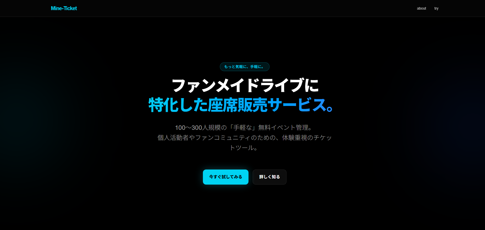
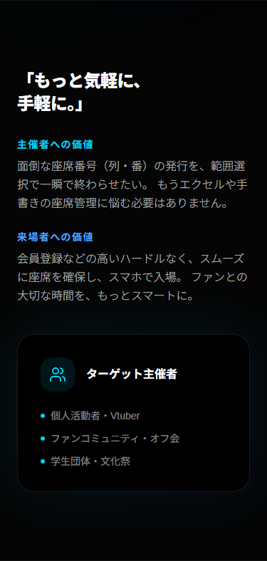

# Mine-Ticket
**リンク(デモサイト): [https://mine-ticket.vercel.app](https://mine-ticket.vercel.app)**

「Mine-Ticket」は、ファンメイド・無料イベントに特化した「手軽さ」と「気軽さ」を追求したチケット管理プラットフォームです。Next.js 15、TypeScript、Tailwind CSS 4 を使用し、小規模（100〜300人）なイベント運営を強力にサポートします。

-----

## 主要な機能とUI/UX

### 多彩な入場方式への対応

イベントの性質に合わせて、3つの入場方式から選択可能です。

- **自由席 (FREE_SEATING)**: 来場者が座席表から好きな場所を選択して予約できます。
- **指定席 (ASSIGNED_SEATING)**: 来場者が枚数のみを指定し、システムがランダムに最適席を割り当てます。
- **整理券 (NUMBERED)**: 座席管理を行わず、入場番号のみを発行する最もシンプルな形式です。

**技術的な工夫**: Prismaを用いた動的な座席(Seat)管理とチケット(Ticket)の紐付けにより、複雑な座席の状態管理（空席、予約済、ブロック）を効率的に行っています。

---

### モバイル優先のレスポンシブデザイン

外出先での申込みや当日受付を考慮し、全ての機能をモバイルデバイスに最適化しています。

| 項目 | 詳細 |
| ---- | ---- |
| 主要技術 | **Next.js 15 (App Router)**, **TypeScript**, **Prisma** |
| スタイリング | **Tailwind CSS 4** (モダン・ダークUI) |
| データベース | **PostgreSQL** (Supabase) |
| データ永続化 | Prisma Client |

---

## 使用技術 (技術スタック)

| カテゴリ | 技術名 |
| ---- | ---- |
| **Frontend** | React 19, Next.js 15, Tailwind CSS 4, Lucide React |
| **Backend** | Next.js Server Actions |
| **Database** | Supabase, Prisma (ORM) |
| **Environment** | Vercel, VS Code |

---

## 開発期間・体制

- **開発体制**: 個人開発
- **開発期間**: 2026.01.22 ~ 2026.02.24 (約30時間)

---

## 工夫した点・苦労した点

- **UIデザイン**: 「ファンメイド」のワクワク感を演出するため、ネオンカラーとダークモードを基調とした、プレミアム感のあるデザインを採用しました。
- **座席管理**: 2次元の座席グリッド(列・番)をプログラムで一括生成し、かつ個別に状態を扱えるようにするスキーマ設計に注力しました。

---

## ライセンス

MIT License

Copyright (c) 2026 minena / Umamimi

Permission is hereby granted, free of charge, to any person obtaining a copy
of this software and associated documentation files (the "Software"), to deal
in the Software without restriction, including without limitation the rights
to use, copy, modify, merge, publish, distribute, sublicense, and/or sell
copies of the Software, and to permit persons to whom the Software is
furnished to do so, subject to the following conditions:

The above copyright notice and this permission notice shall be included in all
copies or substantial portions of the Software.

THE SOFTWARE IS PROVIDED "AS IS", WITHOUT WARRANTY OF ANY KIND, EXPRESS OR
IMPLIED, INCLUDING BUT NOT LIMITED TO THE WARRANTIES OF MERCHANTABILITY,
FITNESS FOR A PARTICULAR PURPOSE AND NONINFRINGEMENT. IN NO EVENT SHALL THE
AUTHORS OR COPYRIGHT HOLDERS BE LIABLE FOR ANY CLAIM, DAMAGES OR OTHER
LIABILITY, WHETHER IN AN ACTION OF CONTRACT, TORT OR OTHERWISE, ARISING FROM,
OUT OF OR IN CONNECTION WITH THE SOFTWARE OR THE USE OR OTHER DEALINGS IN THE
SOFTWARE.